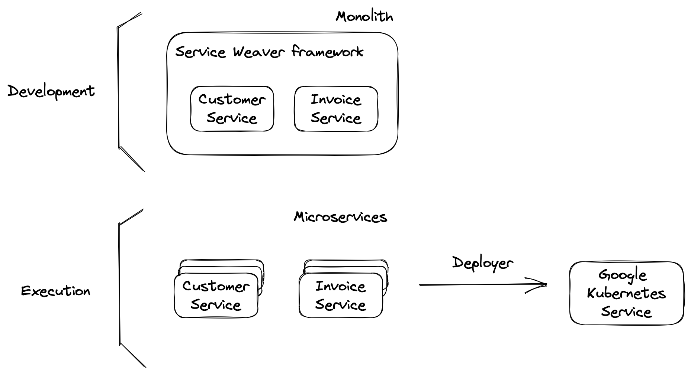

## Service Weaver example

This is a "hello world" example to illustrate how [Service Weaver](https://serviceweaver.dev) framework works.



Run locally:

```
$ weaver generate
$ go run .
```

Deploy in Google Kubernetes Service:

```
$ weaver gke deploy weaver.toml
```

This code belongs to my blog post [](https://hvalls.dev/posts/service-weaver).
